# InfiniTime-uOF

A personal fork of [InfiniTime](https://github.com/InfiniTimeOrg/InfiniTime) **1.16.1** for the
[PineTime](https://pine64.org/devices/pinetime/), carrying four extra watch faces, four games,
a storage monitor and an OBD-II car dashboard.

Builds report their version as `<upstream>+uo<N>` (currently on upstream 1.16.1), so you can tell
them apart from stock in Settings → System Info and over BLE. See [`CHANGELOG.uo.md`](CHANGELOG.uo.md)
for the versioning scheme and release history. Upstream behaviour is otherwise unchanged: nothing
is removed, and no stock feature is modified.

## Watch faces

All four are drawn entirely in code from coloured LVGL rectangles and text. There are no bitmap
assets, so nothing extra has to be flashed to the external SPI flash and `IsAvailable()` returns
true unconditionally.

| | |
|---|---|
| 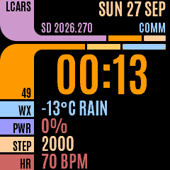 | 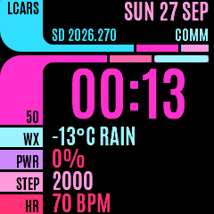 |
| **LCARS** | **LCARS Neon** |
| 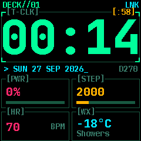 | 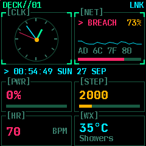 |
| **Cybrdek** | **Cybrdek Rnnr** |

**LCARS / LCARS Neon.** A *TNG*-style console frame adapted to 240×240. A curved elbow sweeps
from the header into a left sidebar carrying weather, battery, steps and heart rate. The header
shows the date, a `SD <year>.<day-of-year>` stardate, a `COMM` indicator that dims when Bluetooth
drops, and an `MSG` flag on unread notifications.

Both variants are one implementation. `LcarsPalette` is a struct of eight semantic colour roles,
so the layout is skinned twice: `lcarsClassic` in TNG amber/mauve/periwinkle, `lcarsNeon` in
magenta and cyan. A third colourway is one more `constexpr LcarsPalette`.

LVGL 7 has no per-corner border radius, so the elbows are built by overlaying squared-off blocks
on a rounded rectangle and carving the concave inner curve with a black rounded rect.

**Cybrdek / Cybrdek Rnnr.** A green-on-black terminal readout with bracketed panel headers.
Cybrdek is a large digital clock over a 2×2 grid of power, steps, heart rate and weather, each
with a bar meter. Rnnr replaces the clock with a miniature analogue one beside an animated panel:
a scrolling waveform, a rolling four-byte hex dump, and a meter cycling through
`SCAN → BREACH → DECRYPT → UPLINK`.

That panel is decorative. It is driven by a small PRNG and does nothing.

## Games

| | | |
|---|---|---|
| 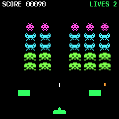 | 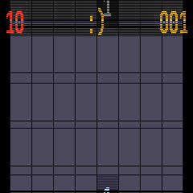 | 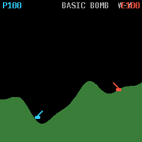 |
| **Spaced Perpetrators** | **Minepeepers** | **Tanked** |
| 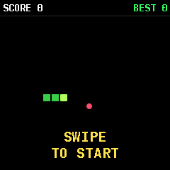 | 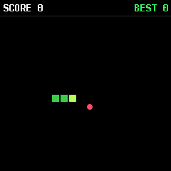 | 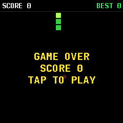 |
| **Snake** | **Snake, playing** | **Snake, game over** |

**Spaced Perpetrators.** A *Space Invaders* homage. Descending rows of three enemy types,
destructible bunkers, a drifting UFO, score and lives. Uses sprite images from the external
resource pack (`si_*.png`).

**Minepeepers.** Minesweeper. Tap to reveal, long-press to flag, with a mine counter and timer.
The grid is sized for fingertips rather than a mouse pointer.

**Tanked.** Two-tank artillery over procedurally generated terrain. Hold the side button to charge
shot power and release to fire; double-tap opens a shell menu (Basic Bomb, Heavy Shell, Nuke,
Cluster, Roller, Digger, Sniper, Napalm and more). Blasts carve craters out of the landscape.
Swipe down to quit.

Because Tanked uses press-and-hold on the button, this fork adds an opt-in hook to `Screen`:
`OnButtonDown()` / `OnButtonUp()` deliver raw presses, and `WantsRawButton()` lets an app stop
DisplayApp from exiting it on a long press. The default is `false` and only Tanked overrides it,
so every stock app behaves exactly as upstream.

**Snake**: swipe to steer, eat to grow, don't hit the walls or yourself. It speeds up with every
meal. Tap to play again after a game over; the side button quits. Best score is kept until the
watch restarts. The game rules are in `src/components/snake/` with a host-side test in
`tests/snake/`, runnable on any machine with g++.

These are original implementations written against the original games' mechanics. No third-party
game code is included.

## Vol Space

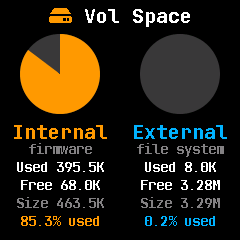

A settings screen showing used and free space on both of the watch's volumes (the internal
application flash and the external SPI flash holding fonts and images) as pie charts with exact
figures.

The internal total is read at runtime from `TotalFlashSize`, exported by both linker scripts
(`gcc_nrf52.ld` and `gcc_nrf52-mcuboot.ld`) rather than hardcoded, so it stays correct if the
memory map changes.

Useful when adding features to a build that is already close to its flash ceiling.

## Car (OBD-II dashboard)

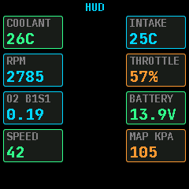

A menu leading to a speed dial, a boost/vacuum gauge, and a multi-stat HUD showing coolant,
intake, RPM, throttle, O₂ sensor, battery voltage, speed and manifold pressure.

**The BLE adapter transport is not implemented yet.** Readings come from `ObdSimulator`, the only
current implementation of the `ObdSource` interface in `src/components/car/`. Demo mode is off by
default, so on a real watch the app reports that no adapter is connected rather than showing
invented numbers.

The display code reads from `ObdSource`, so a real transport can be added underneath without
touching the screens. When it is written it will be **BLE only**, because the PineTime's nRF52832 has no
Bluetooth Classic radio, so Bluetooth Classic ELM327 dongles cannot work with this hardware
regardless of firmware.

## Fonts

The LCARS faces use [Antonio](https://fonts.google.com/specimen/Antonio) Bold, a condensed
grotesque much closer to the LCARS register than InfiniTime's stock JetBrains Mono. It is
generated at build time into three sizes (64 / 24 / 16) at 2 bits per pixel, so the large numerals
are antialiased rather than the stock 1-bit.

Antonio's generated glyph ranges are uppercase-only, which is why the weather condition string is
upper-cased at runtime before display.

Antonio is licensed under the SIL Open Font License; see
[`Antonio-OFL.txt`](src/displayapp/fonts/Antonio-OFL.txt).

`SpaceInvaders.ttf` is a single-glyph icon font (`U+E001`) merged into `jetbrains_mono_bold_20`
to provide the Spaced Perpetrators launcher icon.

## Building

Standard InfiniTime build. You need the ARM toolchain, the nRF5 SDK,
[`lv_font_conv`](https://github.com/lvgl/lv_font_conv), and a Python environment with `Pillow`,
`adafruit-nrfutil`, and the packages in [`tools/mcuboot/requirements.txt`](tools/mcuboot/requirements.txt):

```sh
cmake -S . -B build \
  -DCMAKE_BUILD_TYPE=Release \
  -DARM_NONE_EABI_TOOLCHAIN_PATH=<path to gcc-arm-none-eabi> \
  -DNRF5_SDK_PATH=<path to nRF5_SDK_15.3.0> \
  -DBUILD_DFU=1 -DBUILD_RESOURCES=1 \
  -DTARGET_DEVICE=PINETIME

cmake --build build --target pinetime-mcuboot-app -j"$(nproc)"
```

The flashable package lands at `build/src/pinetime-mcuboot-app-dfu-<version>.zip`, where `<version>`
is the full version string such as `1.16.1+uo2`. Or grab it from
[Releases](../../releases/latest).

The version suffix is computed in the top-level [`CMakeLists.txt`](CMakeLists.txt). CMake's
`project(VERSION)` only accepts numeric components, so the `+uo<N>` part is appended separately and
flows through to `versionString` and every artifact filename. [`CHANGELOG.uo.md`](CHANGELOG.uo.md)
explains how release and dev builds are numbered.

To build a subset, override the app and watch face lists at configure time:

```sh
cmake -S . -B build -DENABLE_WATCHFACES="WatchFace::Digital, WatchFace::Lcars" ...
```

See [upstream's documentation](https://github.com/InfiniTimeOrg/InfiniTime/blob/main/doc/buildAndProgram.md)
for full build and flashing instructions, and [`README.InfiniTime.md`](README.InfiniTime.md) for the
original project README.

## Installing

Two files, both from the [latest release](../../releases/latest), flashed over Bluetooth with any
InfiniTime-compatible updater: [Gadgetbridge](https://gadgetbridge.org/),
[InfiniLink](https://github.com/InfiniTimeOrg/InfiniLink) or [Siglo](https://github.com/alexr4535/siglo):

1. **`pinetime-mcuboot-app-dfu-<version>.zip`**: the firmware.
2. **`infinitime-resources-<version>.zip`**: the resource pack for the external flash.

The resource pack is required for **Spaced Perpetrators**: its sprites live on the external flash,
and the game hides itself from the launcher until they are present, using the same mechanism upstream
uses for the Infineat watch face. Everything else works from the firmware alone.

This is a normal InfiniTime image with a valid bootloader header, so reverting is just flashing an
official release back over it.

## Status and support

A personal build, pinned to 1.16.1 and not tracking upstream. It has not been submitted to
InfiniTime and is not endorsed by or affiliated with the InfiniTime project or Pine64.

Bug reports about *the additions in this fork* are welcome. Anything else belongs
[upstream](https://github.com/InfiniTimeOrg/InfiniTime/issues).

## Licence

GPLv3, inherited from InfiniTime; see [`LICENSE`](LICENSE). Everything added here is GPLv3 on the
same terms.

All credit for the firmware itself goes to the
[InfiniTime contributors](https://github.com/InfiniTimeOrg/InfiniTime/graphs/contributors); this
fork only adds screens to their work.
